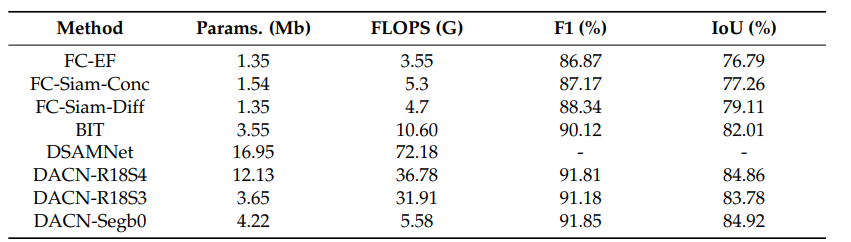

# RS ChangeDetection base on mmsegmentation 

## Description

这个项目主要基于`mmseg`的模型结构实现了遥感影像变化检测。
主要改动如下：

1. 训练控制流程中，在`mmseg`原有基础上添加了 `pytorch-lightning` 来控制训练和验证流程。支持使用`BatchSize`来验证数据集，`DDP`分布式训练等设置。
2. 优化器和学习率调整策略方面，考虑到`mmseg`与标准`torch`官方的实现方式有差异，增加了适用与`pytorch-lightning`x训练流程的优化器和学习率调整方式。
3.  配置文件方面，分为`configs`和`hydra_configs`两个文件夹。前者与通用的`mmseg`保持一致,使用`.py`文件作为配置文件来控制模型的定义，后者通过`.yaml`文件来控制训练流程参数。

### Prerequisites

- Python 3.7
- PyTorch 1.9.0
- pytorch_lightning==1.8.0
- hydra-core==1.2.0
- [MIM](https://github.com/open-mmlab/mim)
- [MMSegmentation](https://github.com/open-mmlab/mmsegmentation) v0.29.1


### Training commands
`mmseg`  官方训练脚本（单卡）----对应 `config` 文件夹

```shell
python  train.py  configs\fp16_LEVIR_pdacn.py --work-dir logs\config_xiongan --gpu-id 0 --seed 42
```
`pytorch-lightning` 自定义训练脚本（单卡）----对应 `hydra_configs` 文件夹

```shell
python  train_lightning.py cfg_path=configs\fp16_LEVIR_pdacn.py  experiment=epoch_300_adamw_poly 
```

多卡训练
```shell
python  train_lightning.py  cfg_path=configs\fp16_LEVIR_pdacn.py experiment=epoch_300_adamw_poly  trainer=ddp trainer.gpus=[0,1,2,3]
```

### Testing commands


LEVIRCD 数据集
```shell
python test.py configs\fp16_LEVIR_pdacn.py   ${CHECKPOINT_PATH} --eval mFscore mIoU
```


| Method | Backbone    | Crop Size |   Lr schd | Params. (Mb) |  mIoU | config                                | notebook                                  |
| ------ | ----------- | --------- | --------: | ------------ | ----: | ------------------------------------- | ----------------------------------------- |
| DACN   | Segformerb0 | 256x256   | 300 epoch | 4.22         | 72.25 | [config](configs/fp16_LEVIR_pdacn.py) | [LEVIRCD实验](notebook/LEVIRCD实验.ipynb) |



## Citation